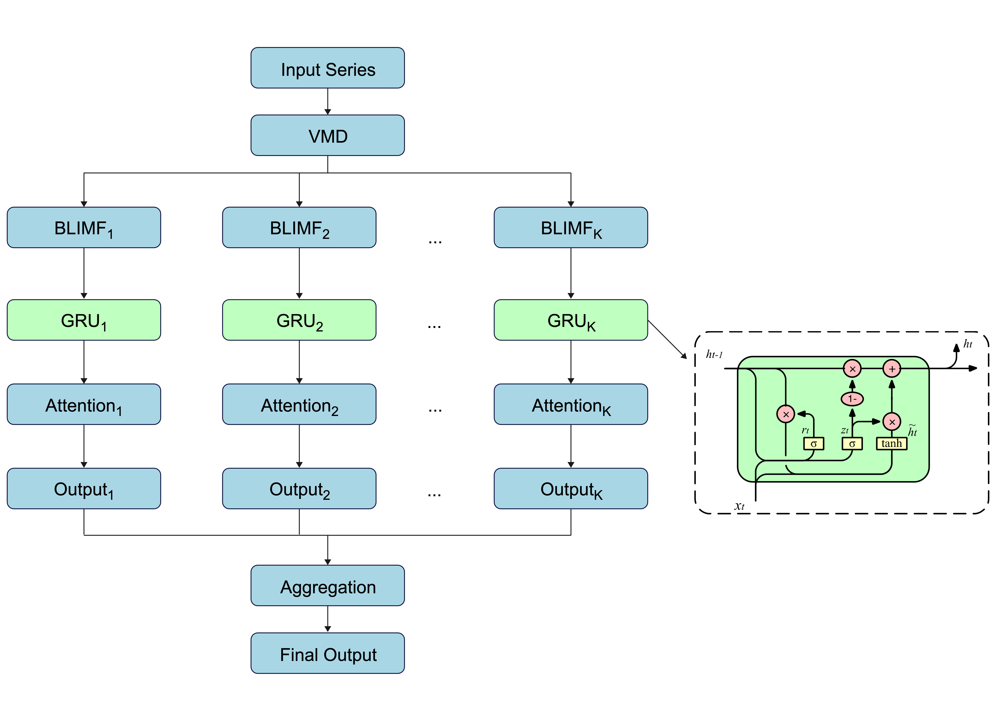
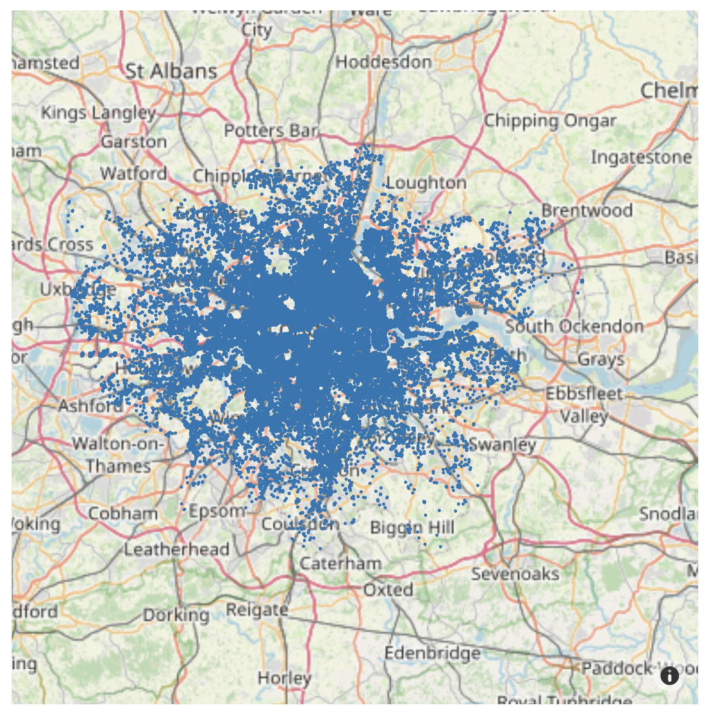
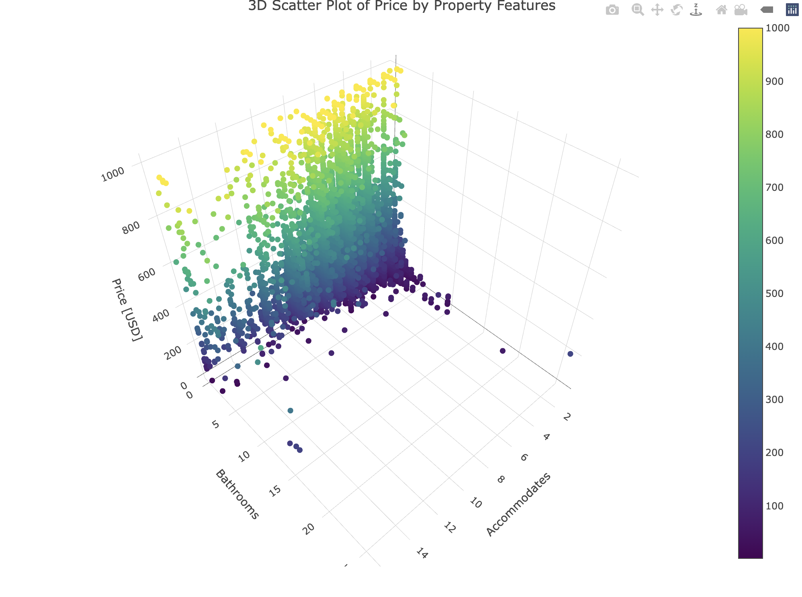
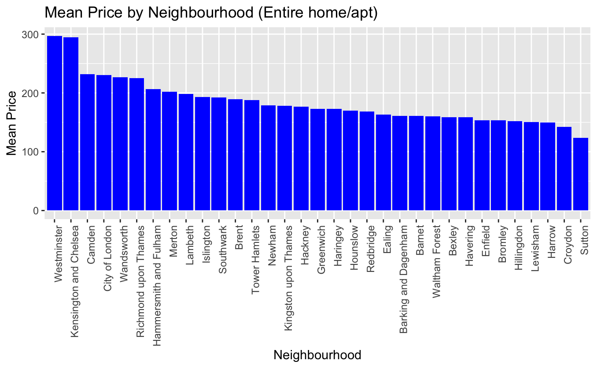
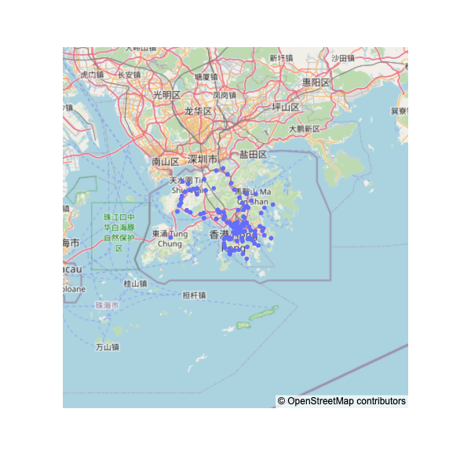
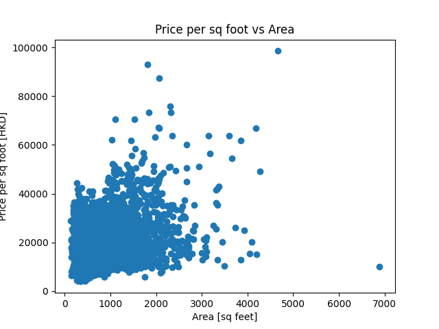
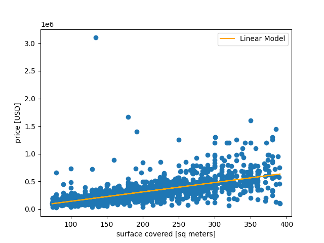
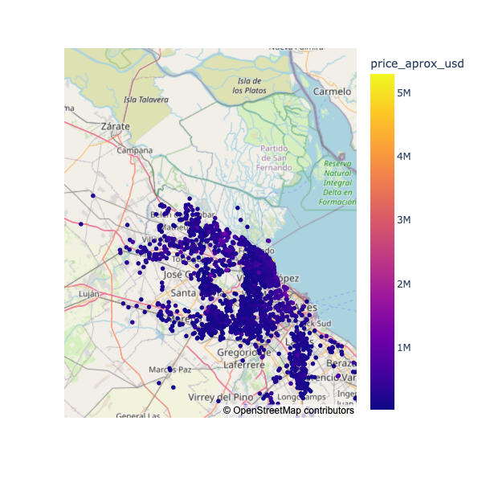
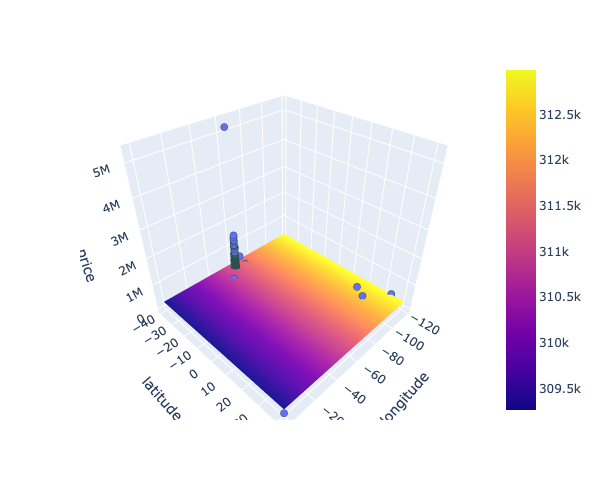
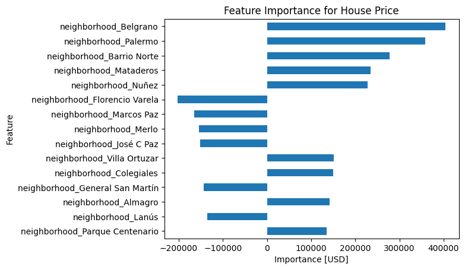

# Alex's Portfolio

## Welcome!

Hi, welcome to my portfolio site! I'm Alex Zheng, an economics student with a passion for data science and machine learning. Here, you can find information about my projects.

---

## ["Market Efficiency of Bitcoin in 2024: Evidence from Statistical and Deep Learning Models"](https://github.com/alexzheng123/EC331-project)

- Undergraduate dissertation analysing the weak form Efficient Market Hypothesis (EMH) of Bitcoin using 1-minute BTC/USD data from 2024.
- Applied both traditional statistical tests (e.g. Ljung-Box, Hurst, BDS) and deep learning models (GRU, VMD-GRU-Attention).
- Proposed and tested a novel VMD-GRU-Attention model that achieved strong predictive performance in forecasting returns, challenging the weak form EMH and suggesting that potentially exploitable trading opportunities may exist within the Bitcoin market.

### Model Comparison:

| Model                          | Test MAE | Test RMSE |
|-------------------------------|----------|-----------|
| Naïve Benchmark               | 0.0476   | 0.0749    |
| ARIMA                         | 0.0476   | 0.0749    |
| GRU (basic)                   | 0.0480   | 0.0749    |
| GRU (with macro/sentiment)    | 0.0478   | 0.0749    |
| VMD-AttGRU (from literature)  | 0.0457   | 0.0703    |
| **VMD-GRU-Attention (proposed)** | **0.0158** | **0.0239** |

### Key Visualisations:

#### Bitcoin Price & Volume (2024)

#### VMD-GRU-Attention Architecture

#### Variational Mode Decomposition (VMD)

#### Forecast vs Actual (Validation & Test)

  
  

---

## [London Airbnb Price Forecasting](https://github.com/alexzheng123/London-Airbnb)
[View Interactive Visualisations (Mapbox & 3D Plot)](https://alexzheng123.github.io/London-Airbnb)

- Compared econometric and machine learning models to forecast Airbnb listing prices in London using data from [Inside Airbnb](https://insideairbnb.com/get-the-data/).
- Cleaned a dataset of 95,000+ listings down to 60,000+ after preprocessing and outlier removal.
- Focused on "Entire home/apt" listings to analyse how location, size, and availability affect prices.

### Key Highlights:

- Geospatial analysis revealed Westminster, Kensington and Chelsea as the most expensive areas.
- Ridge and LASSO provided interpretable insights, highlighting neighbourhood effects.
- Random Forest achieved the best predictive accuracy (Test MAE: **45.40**), outperforming Feedforward Neural Network and baselines.

### Model Comparison:

| Model                          | Validation MAE | Test MAE |
|--------------------------------|----------------|----------|
| Baseline (Mean Price)          | 97.23          | 97.93    |
| Ridge Regression               | 61.82          | 61.88    |
| LASSO Regression               | 62.23          | 62.23    |
| Random Forest (Bayesian tuned) | **45.79**      | **45.40**|
| Feedforward Neural Network     | 52.94          | 53.62    |

### Visual Highlights:

  
  
  

---

## [Project 1: Hong Kong Housing Price Data Science Project](https://github.com/alexzheng123/Hong-Kong-Housing-Price)

- Scraped housing information from Centaline Property Agency.
- Cleaned and processed the data, including geocoding addresses.
- Conducted various visualisations and analyses to understand the housing market in Hong Kong.
- Investigated the influence of location and house size on property prices.

### Key Insights:

- Location has a more significant impact on house prices than size.
- Detailed visualisations of housing data on an interactive map.
- Statistical analysis revealing correlations between price and area.

### Key Highlights:

    
    

---

## [Project 2: Buenos Aires Housing Price Prediction Project](https://github.com/alexzheng123/Buenos-Aires-Property-Market)

- Predicted housing prices in Buenos Aires using factors like size, location, and neighbourhood.
- Cleaned and prepared data, removing outliers and applying one-hot encoding for categorical features.
- Built multiple regression models (baseline, linear, and Ridge) across different dimensions.
- Visualised geographical price patterns using Mapbox and 3D scatter plots.
- Assessed model performance and identified influential neighbourhoods.

### Key Highlights

    
    
    
    

---

## [Project 3: Cat Image Identification Using Deep Learning](https://github.com/alexzheng123/Cat_Image_Classification)

- Developed a deep neural network model to classify images as either containing a cat or not.
- Implemented a 5-layer neural network architecture using ReLU activations and a sigmoid output layer.
- Trained on a dataset of 64×64 images and achieved over 98% accuracy on the training set and 82% on the test set.

### Key Steps:

- Data pre-processing: Flattened, reshaped, and normalised input images.
- Built the neural network: [LINEAR → RELU] × (L−1) → LINEAR → SIGMOID.
- Backpropagation: Implemented gradient descent for weight updates.
- Evaluation: Tested the model on new images and visualised the results.
