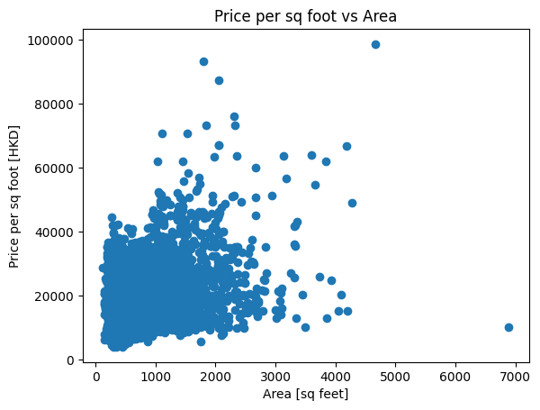

# Alex's Portfolio

## Welcome!

Hi, Welcome to my portfolio site! I'm Alex Zheng, an undergraduate student studying Economics with a passion for finance and data science. Here you can find information about my data science projects.

## [Project 1: Hong Kong Housing Price Data Science Project](https://github.com/alexzheng123/Hong-Kong-Housing-Price)
- Scraped housing information from Centaline Property Agency.
- Cleaned and processed the data, including geocoding addresses.
- Conducted various visualizations and analyses to understand the housing market in Hong Kong.
- Investigated the influence of location and house size on property prices.
- Key insights:
  - Location has a more significant impact on house prices than size.
  - Detailed visualizations of housing data on an interactive map.
  - Statistical analysis revealing correlations between price and area.

### Key Highlights

    
    

## [Project 2: Buenos Aires Housing Price Prediction Project](https://github.com/alexzheng123/Buenos-Aires-Property-Market)
- Focused on predicting housing prices in Buenos Aires based on factors such as size, location, and neighborhood.
- Divided analysis into several notebooks, each addressing different aspects of the prediction model.

### Notebooks Overview

#### 1. Prepare Data
- Prepared the dataset by cleaning, handling missing values, and conducting initial exploratory data analysis.
- Key Steps:
  - Plotted a histogram of `surface_covered_in_m2` and removed outliers.
  - Built a data wrangling function to filter data for houses.

#### 2. Predicting House Price with Size
- Explored the relationship between house size and price using a linear regression model.
- Key Steps:
  - Plotted the distribution of house sizes and a scatter plot of price vs. area.
  - Calculated the correlation between `surface_covered_in_m2` and `price_aprox_usd`.
  - Built and evaluated a baseline and linear regression model.

#### 3. Predicting House Price with Location
- Investigated how the location of a property influences its price with geographical analysis and visualization.
- Key Steps:
  - Plotted a mapbox location and price visualization, and a 3D scatter plot.
  - Built and evaluated a linear regression model to predict house prices based on location.

#### 4. Predicting Price with Neighborhood
- Analyzed the impact of neighborhood characteristics on house prices using Ridge regression to handle overfitting.
- Key Steps:
  - Cleaned data, extracted neighborhood information, and applied one-hot encoding.
  - Built and evaluated the model, identifying significant neighborhoods affecting house prices.

### Key Highlights

    
    
    
    

